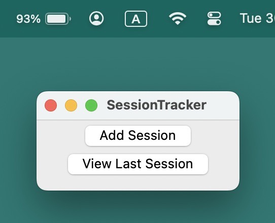
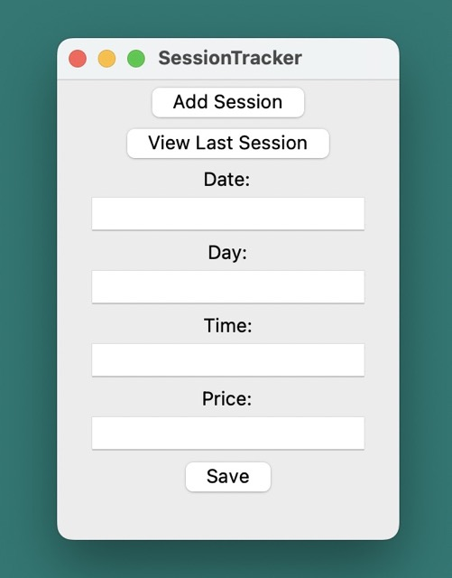

# SessionTracker

**SessionTracker** is a simple desktop application created with Python and Tkinter, designed to assist users in logging and tracking sessions. It proves to be a valuable tool for individuals undergoing long-term therapies, such as psychotherapy. Users can seamlessly document and monitor their therapy sessions over an extended period, ensuring a comprehensive overview of their therapeutic journey. This feature enables better insight into progress, session frequency, and associated timestamps, enhancing the overall management of long-term therapeutic processes.

## Features
- **Add Sessions**: Easily add new sessions with details like date, day, time, and price.
- **Save to CSV**: All session data is saved to a CSV file for convenient storage and future reference.
- **View Last Session**: Quickly view information about the last recorded session.

## Getting Started

### Prerequisites
- Python 3.x
- Tkinter (usually included with Python installations)

### Installation
1. Clone or download the repository to your local machine.
2. Open a terminal or command prompt and navigate to the project directory.

### Usage
1. Run the `SessionTracker.py` file.
2. Use the "Add Session" button to input details of a new session.
3. Click "Save" to store the session data in the CSV file.
4. Switch to the "View Last Session" tab to see information about the most recent session.

## Screenshots

- *Main Menu: Click on "Add Session"*

- *Add Session Menu: Enter information about the session*

## Contributing

If you have suggestions, enhancements, or bug fixes, feel free to open an issue or create a pull request. Contributions are welcome!

## License

This project is licensed under the MIT License - see the [LICENSE](LICENSE) file for details.
